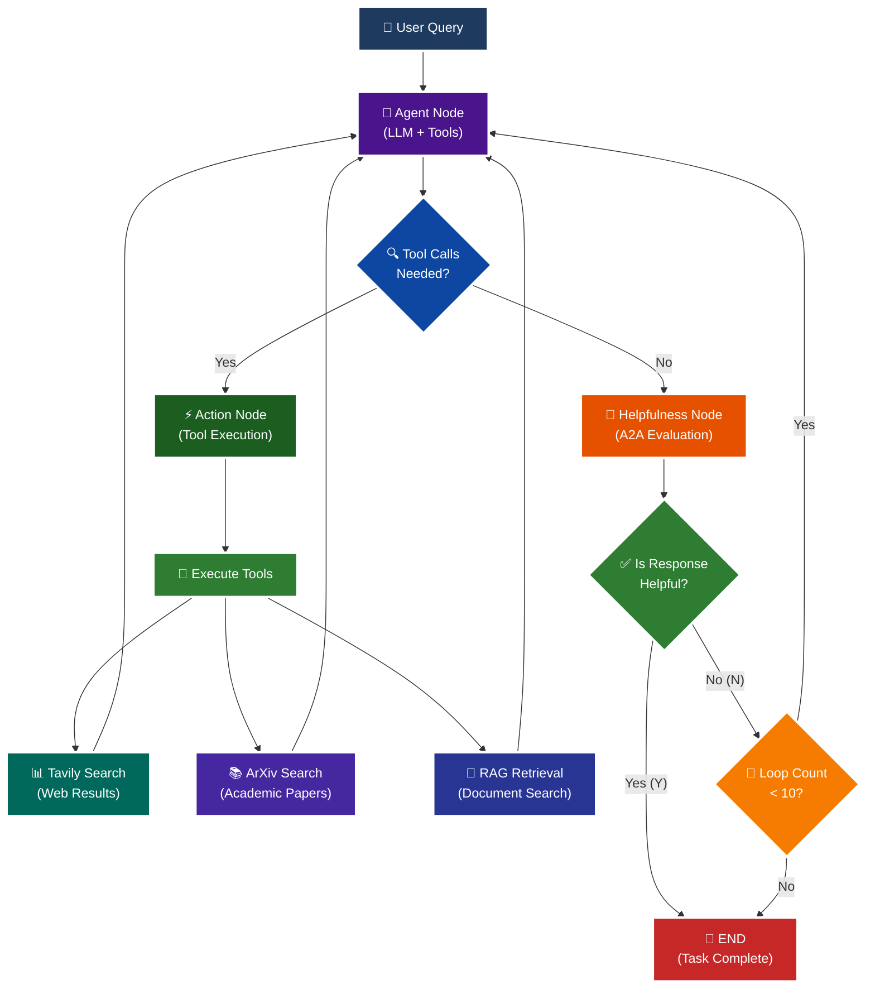

<p align = "center" draggable="false" >
</p>

## <h1 align="center" id="heading">Session 15: Build & Serve an A2A Endpoint for Our LangGraph Agent</h1>

| 🤓 Pre-work | 📰 Session Sheet | ⏺️ Recording     | 🖼️ Slides        | 👨‍💻 Repo         | 📝 Homework      | 📁 Feedback       |
|:-----------------|:-----------------|:-----------------|:-----------------|:-----------------|:-----------------|:-----------------|

# A2A Protocol Implementation with LangGraph

This session focuses on implementing the **A2A (Agent-to-Agent) Protocol** using LangGraph, featuring intelligent helpfulness evaluation and multi-turn conversation capabilities.

## 🎯 Learning Objectives

By the end of this session, you'll understand:

- **🔄 A2A Protocol**: How agents communicate and evaluate response quality

## 🧠 A2A Protocol with Helpfulness Loop

The core learning focus is this intelligent evaluation cycle:



# Build 🏗️

Complete the following tasks to understand A2A protocol implementation:

## 🚀 Quick Start

```bash
# Setup and run
./quickstart.sh
```

```bash
# Start LangGraph server
uv run python -m app
```

```bash
# Test the A2A Serer
uv run python app/test_client.py
```

### 🏗️ Activity #1:

Build a LangGraph Graph to "use" your application.

Do this by creating a Simple Agent that can make API calls to the 🤖Agent Node above through the A2A protocol. 

### ❓ Question #1:

What are the core components of an `AgentCard`?

##### ✅ Answer:

The core components of an `AgentCard` include:

1. **Basic Identity**:
   - `name`: The agent's display name (e.g., "General Purpose Agent")
   - `description`: A detailed description of what the agent does
   - `url`: The endpoint URL where the agent can be reached
   - `version`: The agent's version number (e.g., "1.0.0")

2. **Communication Modes**:
   - `default_input_modes`: Supported input content types the agent can accept
   - `default_output_modes`: Supported output content types the agent can produce

3. **Capabilities** (`AgentCapabilities`):
   - `streaming`: Whether the agent supports real-time streaming responses
   - `push_notifications`: Whether the agent can send push notifications

4. **Skills** (`AgentSkill` array):
   - `id`: Unique identifier for each skill
   - `name`: Human-readable name of the skill
   - `description`: What the skill does
   - `tags`: Categorization tags for the skill
   - `examples`: Example queries that would use this skill

The AgentCard essentially serves as a "business card" that describes what an agent can do, how to communicate with it, and what capabilities it offers, enabling other agents to discover and interact with it through the A2A protocol.

<br />

### ❓ Question #2:

Why is A2A (and other such protocols) important in your own words?

##### ✅ Answer:

A2A (Agent-to-Agent) protocols are crucial for several key reasons:

**1. Interoperability & Standardization**: A2A protocols create a common language and communication standard that allows different AI agents from various developers and organizations to seamlessly interact with each other. Without such protocols, each agent would be an isolated island, unable to leverage the capabilities of others.

**2. Scalable AI Ecosystems**: As AI agents become more specialized and numerous, A2A protocols enable the creation of complex, multi-agent systems where agents can collaborate, delegate tasks, and build upon each other's strengths. This leads to more powerful and capable AI systems than any single agent could achieve alone.

**3. Quality Assurance & Evaluation**: The A2A protocol includes built-in evaluation mechanisms (like the helpfulness loop in this implementation) that ensure agents provide high-quality responses. This creates a self-improving system where agents can assess and refine their outputs, leading to better overall performance.

**4. Modularity & Specialization**: A2A protocols allow for highly specialized agents that excel at specific tasks while still being able to collaborate. For example, one agent might specialize in web search, another in academic research, and another in document analysis - all working together through the A2A protocol.

**5. Future-Proofing**: As AI technology evolves, A2A protocols provide a stable foundation that can accommodate new agent types, capabilities, and communication patterns without requiring complete system overhauls.

In essence, A2A protocols are the "HTTP for AI agents" - they enable the distributed, collaborative, and scalable AI systems that will power the next generation of intelligent applications.

<br /><br />

<details>
<summary>🚧 Advanced Build 🚧 (OPTIONAL - <i>open this section for the requirements</i>)</summary>

Use a different Agent Framework to **test** your application.

Do this by creating a Simple Agent that acts as different personas with different goals and have that Agent use your Agent through A2A. 

Example:

"You are an expert in Machine Learning, and you want to learn about what makes Kimi K2 so incredible. You are not satisfied with surface level answers, and you wish to have sources you can read to verify information."
</details>

## 📁 Implementation Details

For detailed technical documentation, file structure, and implementation guides, see:

**➡️ [app/README.md](./app/README.md)**

This contains:
- Complete file structure breakdown
- Technical implementation details
- Tool configuration guides
- Troubleshooting instructions
- Advanced customization options

# Ship 🚢

- Short demo showing running Client

# Share 🚀

- Explain the A2A protocol implementation
- Share 3 lessons learned about agent evaluation
- Discuss 3 lessons not learned (areas for improvement)

# Submitting Your Homework

## Main Homework Assignment

Follow these steps to prepare and submit your homework assignment:
1. Create a branch of your `AIE8` repo to track your changes. Example command: `git checkout -b s15-assignment`
2. Complete the activity above
3. Answer the questions above _in-line in this README.md file_
4. Record a Loom video reviewing the Simple Agent you built for Activity #1 and the results.
5. Commit, and push your changes to your `origin` repository. _NOTE: Do not merge it into your main branch._
6. Make sure to include all of the following on your Homework Submission Form:
    + The GitHub URL to the `15_A2A_LANGGRAPH` folder _on your assignment branch (not main)_
    + The URL to your Loom Video
    + Your Three Lessons Learned/Not Yet Learned
    + The URLs to any social media posts (LinkedIn, X, Discord, etc.) ⬅️ _easy Extra Credit points!_

### OPTIONAL: 🚧 Advanced Build Assignment 🚧
<details>
  <summary>(<i>Open this section for the submission instructions.</i>)</summary>

Follow these steps to prepare and submit your homework assignment:
1. Create a branch of your `AIE8` repo to track your changes. Example command: `git checkout -b s015-assignment`
2. Complete the requirements for the Advanced Build
3. Record a Loom video reviewing the agent you built and demostrating in action
4. Commit, and push your changes to your `origin` repository. _NOTE: Do not merge it into your main branch._
5. Make sure to include all of the following on your Homework Submission Form:
    + The GitHub URL to the `15_A2A_LANGGRAPH` folder _on your assignment branch (not main)_
    + The URL to your Loom Video
    + Your Three Lessons Learned/Not Yet Learned
    + The URLs to any social media posts (LinkedIn, X, Discord, etc.) ⬅️ _easy Extra Credit points!_
</details>